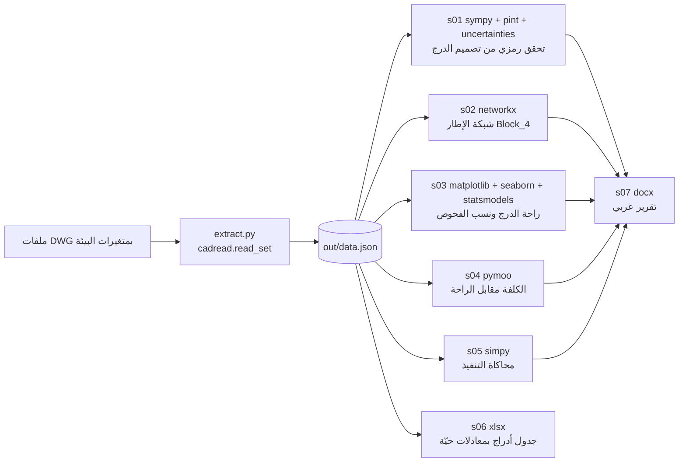

# تجربة المهارات الهندسية على المشروع

مجلد منفصل يطبّق مهارات Scientific Agent Skills الهندسية (`.claude/skills/`) على مخرجات قارئ
الأوتوكاد الحقيقية. **لا يعدّل أي ملف بـ `civil/`**؛ يستورد `cadread` و`stairs` و`engine` للقراءة فقط.



## التشغيل

```bash
python3 -m venv /tmp/skv && /tmp/skv/bin/pip install sympy pint uncertainties numpy scipy pandas \
    matplotlib seaborn statsmodels networkx pymoo simpy openpyxl arabic-reshaper python-bidi
CAD_FIXTURE=blk4.json HOSP_FIXTURE=hosp.json VILLA_FIXTURE=villa.json LIB_FIXTURE=f1.json \
    python3 skills-demo/extract.py
cd skills-demo && for s in s01 s02 s03 s04 s05 s06; do /tmp/skv/bin/python $s*.py; done
python3 ../.claude/skills/xlsx/scripts/recalc.py out/s06_stairs_schedule.xlsx 240
NODE_PATH=<node_modules فيه docx> node s07_report.js
```

- الخط العربي للرسوم من `AR_FONT_DIR` (Noto Sans Arabic أو Amiri، رخصة OFL).
- كل المخرجات في `out/`، وهو مستثنى من git لأنه مشتق من ملفات المستخدم.

## ما تنتجه كل مهارة

| السكربت | المهارة | الناتج |
|---|---|---|
| `s01_stair_symbolic.py` | sympy، uncertainty-and-units | اشتقاق رمزي لـ wD وwu وMu وAs، مع وحدات pint، وعدم تأكد GUM ومونت كارلو، ومقارنة بأرقام المشروع |
| `s02_frame_graph.py` | networkx | مكوّنات الإطار، والأعمدة بلا جسور، وأطراف الجسور بلا ركيزة، والجسور الحرجة |
| `s03_stairs_viz.py` | matplotlib، seaborn، scientific-visualization، statistical-analysis | مخطط R/T مع نطاق بلوندل، ونسب نجاح الفحوص بفاصل ويلسون |
| `s04_stair_optimize.py` | pymoo | جبهة باريتو للكلفة والراحة بقيود ACI 318-19 |
| `s05_construction_sim.py` | simpy | مخطط جانت، وتوزيع المدة P50/P80 |
| `s06_workbook.py` | xlsx | جدول أدراج بمعادلات حيّة وورقة فرضيات |
| `s07_report.js` | docx | تقرير وورد عربي من اليمين لليسار |
